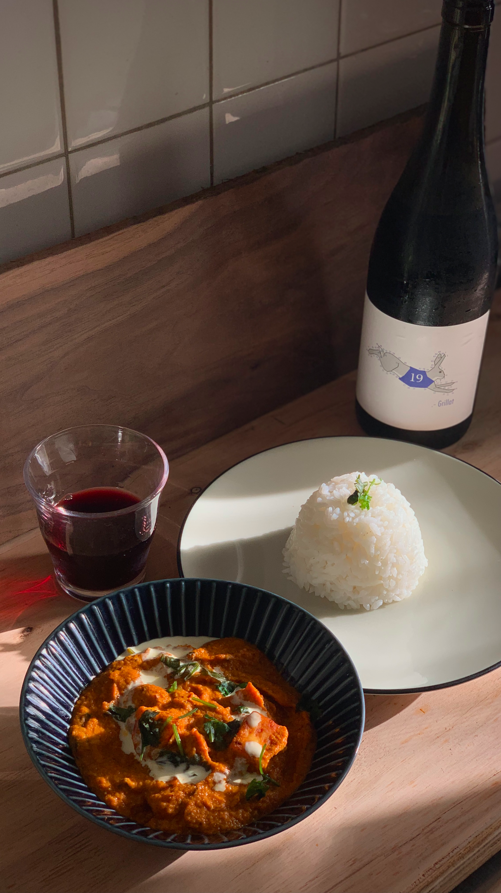
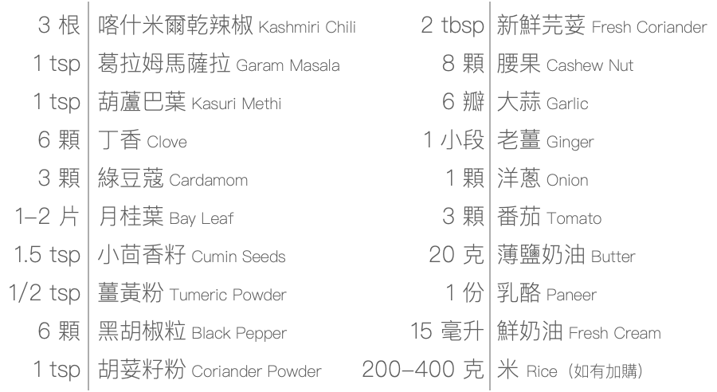

## 乳酪奶油馬薩拉 पनीर बटर मसाला रेसिपी Paneer Butter Masala｜Introduction

濃郁辛香的乳酪奶油馬薩拉，料理方式和材料都是北印度特有的風格，受到旁遮普與阿富汗的影響，一路傳承改良並於 1950 左右成為今天的樣貌，以現在的名稱最初亮相於旁遮普人經營的德里餐廳 Moti Mahal 菜單上。雖然食材眾多，但作法簡單不易失敗，還可以隨著自己的口味變化調整，家家戶戶都適合烹調。
中火炒香各種香料、洋蔥、番茄等蔬菜，機器打勻後過篩，加入煎得金黃的乳酪，起鍋前將鮮奶油像作畫一般勾勒出漂亮弧線，再灑一把新鮮芫荽點綴，好了，我要開動了誰也別攔著。
終於混著米飯吃下第一口，一旁的米先生突然一語不發起立離開座位，走向客廳的空曠處（究竟要幹嘛），我趕緊跟上並戲劇化地抓住他的手臂，才發現他竟然渾身雞皮疙瘩。「太、好、吃、了！這太瘋狂了吧！」

接下來我們倆忍不住手拉手滿屋子轉圈圈，豐富多變的氣味每秒不斷在嘴裡炸出新的層次。一下子太滿足而似乎覺得有點暈（或是因為剛才的轉圈），胃也暖了起來，真是名符其實的 comfort food。新鮮洋蔥甜又嗆，番茄是炯炯有神的酸，還有味道明明柔和，在一群大鳴大放的香料中卻分毫不減存在感的自製乳酪，又嫩又香，整道料理和諧又精彩，我真的會嚇瘋。

## 乳酪奶油馬薩拉 पनीर बटर मसाला रेसिपी Paneer Butter Masala｜Before You Start

### 開始前須知

- 建議將食譜整體大致看過再開始
- 香料味道濃，建議將房間門關上，並讓廚房空氣流通，抽油煙機催蕊
- 所有食材份量已按照食譜分配，不需再計量，但仍可依個人喜好調整，咖哩辣度調整，請看辣度表

- 香料個別包裝可聞聞看味道，香料包裝分成灰色、黃色兩種膠帶，灰色膠帶分兩階段加入，詳細說明請看食材分組
- 如果有加購印度米，煮米的比例為 1 杯米：1 ½ 杯水
- 我們準備了印度歌單幫助你進入狀況，來來來，歌單連結請點我

### 關於廚房器具
- 不鏽鋼網篩用於過濾掉香料的渣渣，讓口感和味道都更滑順。請使用 10-16 目的網篩（篩孔尺寸 1.18-2mm），大概是擋得住綠豆但擋不住小米的大小
- 如果沒有網篩或篩孔太細無法使用，在用機器打勻之前，撈出纖維堅硬的食材例如薑、月桂葉等，並建議參考辣度表，先撈出部分辣椒
- 如果沒有食物調理機、調理棒或果汁機，在食材下鍋前，請先將大蒜、薑、洋蔥、番茄、腰果都盡量切碎

## 乳酪奶油馬薩拉 पनीर बटर मसाला रेसिपी Paneer Butter Masala｜What You’ll Need

- 任一種烹調用植物油（如：葵花油、葡萄籽油）
- 調味用鹽
- 白開水
- 一般菜刀
- 深平底鍋（也可以炒鍋或湯鍋替代，不鏽鋼需注意沾鍋）
- 果汁機或食物調理機
- 不鏽鋼網篩（一般孔徑 10-16 目皆可）

## 材料包裡有

- 3 根：喀什米爾乾辣椒 Kashmiri Chili
- 1 tsp：葛拉姆馬薩拉 Garam Masala
- 1 tsp：葫蘆巴葉 Kasuri Methi
- 6 顆：丁香 Clove
- 3 顆：綠豆蔻 Cardamom
- 1-2 片：月桂葉 Bay Leaf
- 1.5 tsp：小茴香籽 Cumin Seeds
- 1/2 tsp：薑黃粉 Tumeric Powder
- 6 顆：黑胡椒粒 Black Pepper
- 1 tsp：胡荽籽粉 Coriander Powder
- 2 tbsp：新鮮芫荽 Fresh Coriander
- 8 顆：腰果 Cashew Nut
- 6 瓣：大蒜 Garlic
- 1 小段：老薑 Ginger
- 1 顆：洋蔥 Onion
- 3 顆：番茄 Tomato
- 20 克：薄鹽奶油 Butter
- 1 份：乳酪 Paneer
- 15 毫升：鮮奶油 Fresh Cream
- 200-400 克：米 Rice（如有加購）

## 乳酪奶油馬薩拉 पनीर बटर मसाला रेसिपी Paneer Butter Masala｜Recipe

---
#### Step 1｜前置作業

播放背景音樂：點開歌單連結，聽完剛好上菜
準備所需器具：深平底鍋、菜刀、果汁機或食物調理機、鍋鏟或筷子

備料：

    1. 將蔬菜洗淨，蒜拍扁剝皮，老薑削皮取大約 2x2x3cm 的大小，或依個人口味增減

    2. 洋蔥、番茄切塊備用

將部分食材分組備用：
A 組：乾辣椒、丁香、綠豆蔻、月桂葉、 薑黃粉、黑胡椒粒、胡荽籽粉、小茴香籽（包裝中一半）、葛拉姆馬薩拉（包裝中一半）
B 組：葛拉姆馬薩拉（另一半）、葫蘆巴葉

---
#### Step 2｜開火囉，把食材炒香

    1. 中火熱油一大匙，加入大蒜爆香

    2. 加入「材料 A 組」，炒至香味出來（料理包預設口味「小辣」，如果不喜辣可調整辣椒用量）

    3. 加入洋蔥與一小匙鹽（前期鹽巴下手可以保守一些，後面還有機會調味）

    4. 聞到洋蔥香，加入蕃茄拌炒約 5-8 分鐘，觀察火侯，將食材炒軟

    5. 加入奶油 10g（1 顆），拌炒至融化，繼續拌炒 3-5 分鐘（圖為奶油示意，不需挖個坑唷）

---
#### Step 3｜燉成醬汁

    1. 加入 200-300 cc 的常溫開水，或水位約醃至食材高度 50%

    2. 大火煮滾後轉中小火，蓋上鍋蓋燉煮 15 分鐘或至水收乾六七成

    3. 水差不多收乾，食材也都軟爛了盛起食材放涼約 10 分鐘，倒入果汁機打均勻，備用

---
#### Step 4｜準備乳酪

    1. 稍微清潔鍋子，或是用沾溼的廚房紙巾擦過即可

    2. 中火加熱少許植物油以及 10g 奶油（1 顆）

    3. 加入其餘的一半小茴香籽

    4. 乳酪切成方塊，加入鍋中

    5. 輕輕翻動，中火煎至表面金黃，盛起備用
---
#### Step 5｜咖哩合體

    1. 轉小火，將咖哩醬汁過篩倒回鍋中，一邊用湯匙背面攪拌加速過篩，如上圖記得把黏著於網篩外的醬汁刮乾淨

    2. 加入「材料 B 組」，試味道並加入鹽巴調味，拌勻

    3. 攪拌查看咖哩的濃度，一邊試味道加鹽，一邊依喜好加水稀釋或收得更乾，注意火侯

    4. 將煎好備用的乳酪塊加回鍋中

    5. 拌入鮮奶油和新鮮芫荽，起鍋完成！
